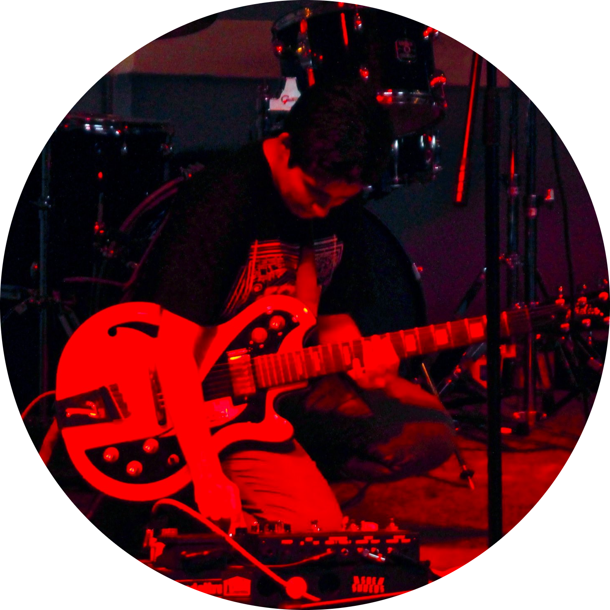

Welcome! I am Zarine, a second-year PhD student in the [Department of Human-Centered Design & Engineering (HCDE)](https://www.hcde.washington.edu/) at the University of Washington.

My research focuses on how online communities **govern and are governed** as they navigate disinformation, cyber-enabled influence operations, and related online harms. I am interested in both top-down dynamics -- **governance by platforms, governments, and international bodies** -- as well as bottom-up dynamics, in **the myriad ways online communities experiment with and enact models of self-governance**.

I use mixed methods, combining ethnographic interviews with computational analyses of digital trace data, to study information flows and governance mechanisms across a variety of platforms -- from Twitter, to Telegram, to Wikipedia.

Previously, I was an associate editor at the Atlantic Council's [Digital Forensic Research Lab (DFRLab)](https://www.atlanticcouncil.org/programs/digital-forensic-research-lab/), where I edited and researched investigations about disinformation and related phenomena. Prior to that, I was the assistant editor of the International Enforcement Law Reporter, where I covered cybersecurity and data protection issues.

I recieved my B.A. in Government and French & Francophone Studies in 2017 from the College of William & Mary, where I also worked as a research assistant in the Social Networks and Political Psychology (SNaPP) Lab studying the psychological underpinnings of political behavior, both online and offline.

I created this page as a repository for my academic work. I am hoping to update it with various projects I am working on in the near future. So, stay tuned.

P.S. I made this static site in RMarkdown + Hugo, using the [Archie theme](https://github.com/athul/archie). [check it](https://bookdown.org/yihui/blogdown/static-sites.html)

